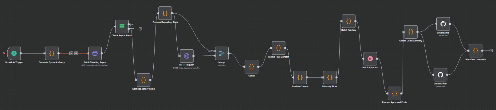

<h1 align="center">🤖 AutoGrow AI/ML GitHub Trends Workflow</h1>

  

  <b>Automated curation of trending AI, ML, and Data Science repositories from GitHub</b> 
  🚀 Daily digests | 📊 Category-aware summaries | 🔒 Token-safe workflow

---

## ✨ Overview

*AutoGrow AI/ML GitHub Trends Workflow* is a production-ready automation that:

- ✅ Fetches trending AI/ML/Data Science repos from GitHub
- ✅ Categorizes by ML, DL, NLP, CV, Data Science, and more
- ✅ Generates technical summaries using LLMs (Gemini API, etc.)
- ✅ Outputs daily markdown digests for your community or team
- ✅ Keeps your API keys and tokens safe (see .gitignore)
- ✅ Runs on AWS EC2 using Docker for deployment and orchestration

To see the results, go to [https://github.com/drago-Codes/daily-ai-trends](https://github.com/drago-Codes/daily-ai-trends)

---

## 🚀 Features

- 🤖 *Automated GitHub Search* – Finds new, high-star AI/ML repos daily
- 🧠 *Smart Categorization* – Tags repos by ML, DL, NLP, CV, etc.
- 📝 *LLM Summaries* – Uses Gemini API or similar LLMs for concise, technical writeups
- 📅 *Batch Digest* – Produces a markdown summary for easy sharing
- 🔒 *Token Redaction* – Sensitive keys are never committed (see .gitignore)
- ⚡ *AWS EC2 & Docker* – Easily deployable, scalable, and customizable

---

## 🛠 Tech Stack

| Layer         | Technology         |
|---------------|-------------------|
| ⚙ Workflow   | AWS EC2 + Docker  |
| 🗃 Data Source | GitHub API         |
| 🧠 AI Engine  | Gemini API (or swap for OpenAI, etc.) |
| 📄 Output     | Markdown digests   |
| 🔒 Security   | .gitignore, token redaction |

---

## 🧪 Example Workflow

1. Scheduled trigger starts the workflow (daily or custom interval)
2. Fetches trending repos from GitHub (AI/ML/Data Science focus)
3. Splits and processes each repo, categorizing by topic
4. Generates technical summaries using an LLM (Gemini API)
5. Batches results into a markdown digest
6. Optionally commits the digest to a GitHub repo

---

## 🧰 Usage

### 🔧 Deploy on AWS EC2 with Docker

1. Launch an AWS EC2 instance (Ubuntu recommended)
2. Clone this repository to your EC2 instance
3. Set up your GitHub and Gemini API credentials in a .env file
4. Build and run the workflow using Docker:
   - `docker build -t github-trends-workflow .`
   - `docker run --env-file .env github-trends-workflow`
5. Adjust schedule, categories, or output as needed
6. The workflow will run automatically or as scheduled

### 🛡 Environment Variables & Security

*Never commit secrets to your repo!*

- All API tokens and keys are now loaded from a .env file (not tracked by git).
- Example .env:

GITHUB_TOKEN=your_github_token_here
GEMINI_API_KEY=your_gemini_api_key_here

- In configuration files, tokens are referenced as environment variables.
- You can safely commit configuration files to GitHub—no secrets are exposed.
- Add .env to your .gitignore (if not already).

---

## 📂 Project Structure

- n8n-agent.json – workflow export (safe to commit, no secrets)
- .env – API tokens and keys (never commit this)
- .gitignore – excludes sensitive files and junk
- README.md – this file
- workflow.png – workflow diagram
- goof – (unknown, user file)

---
